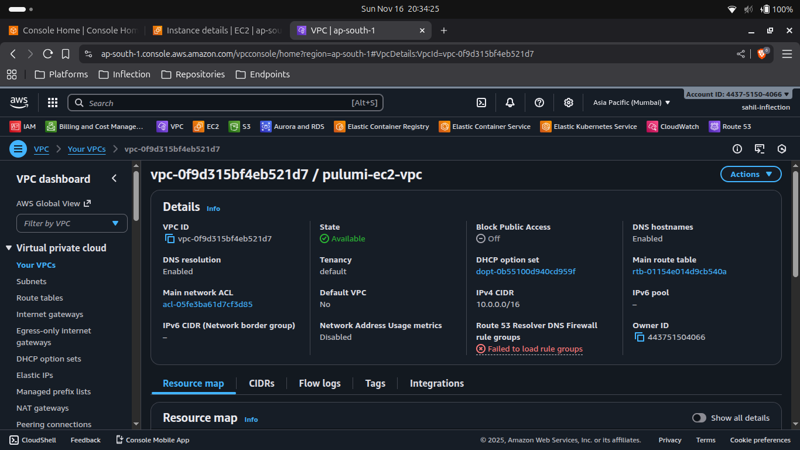
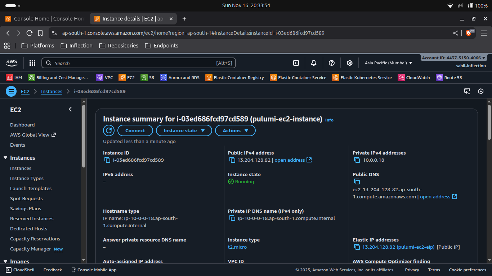
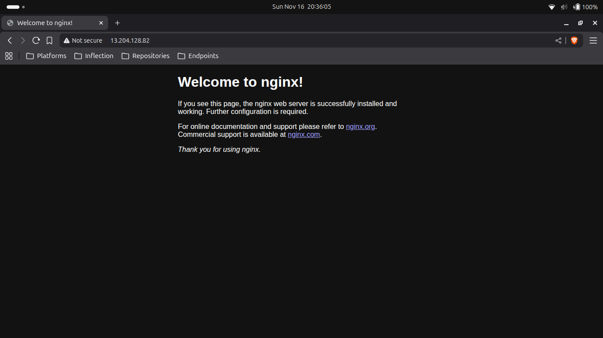

# AWS EC2 Instance Provisioning using Pulumi
- We will provision the AWS EC2 Instance using Pulumi as an Infrastructure as Code.
- We will deploy it in a custom Virtual Private Cloud for isolation.
- We will SSH into the EC2 Instance, and install the docker.
- Then, we will deploy the Nginx Container and try accessing it on the Web Browser.

---
## Prerequisites
---

1. An AWS account.
2. AWS CLI installed and configured with the appropriate Azure User or Service Principal.
3. Pulumi Installed.

---
## Write Pulumi Configuration files
---

First, we will initiate and edit Pulumi configuration files for AWS resources using predefined Pulumi Library available on the internet.

## Steps
1. Create a Pulumi Project directory.
2. Open the Powershell.
3. Change the directory to the above-created Pulumi Project.
4. Run the **`pulumi new aws-python`** command to initialize the *pulumi*.
5. Provide the appropriate values to prompts such as *project-name*, *project-description*, *stack-name*, *toolchain*, *region-name*, etc.
6. This will generate some Pulumi files in this directory.
7. Now we will install predefined Pulumi modules.
8. Activate the **`venv`** by running **`venv\Scripts\activate`**.
9. Run **`pip install git+https://github.com/inflection-sahil/pulumi.git`** to install the modules.
10. Deactivate the **`venv`** by running **`deactivate`**.
11. Now open the directory in the preferred IDE.
12. Create *commons* folder
13. Inside the folder create *__init__.py* file.
14. Import the following in the *__init__.py* file:
    - from inflection_zone_pulumi.modules.aws.vpc import vpc
    - from inflection_zone_pulumi.modules.aws.ec2 import ec2_instance
15. Click [code](https://github.com/inflection-zone/iac-recipes/blob/inflection-sahil/pulumi/aws/ec2/commons/__init__.py) for reference.
16. Definition of *__init__.py* is complete.
17. Now create the *values.py* file in the root folder of the above-created project directory.
18. Define the following values:
    - vpc_properties
    - ec2_properties
19. Click [code](https://github.com/inflection-zone/iac-recipes/blob/inflection-sahil/pulumi/aws/ec2/sample.values.py) for reference.
20. The definition of *values.py* is complete.
21. Now navigate to the *__main__.py* file present in the root folder of the above-created project directory.
22. Clear the sample code if present.
23. Import the following:
    - from commons import vpc, ec2_instance
    - import values
24. Define the following objects and pass the values & dependencies as an argument:
    - VPC
    - EC2
25. Click [code](https://github.com/inflection-zone/iac-recipes/blob/inflection-sahil/pulumi/aws/ec2/__main__.py) for reference.
26. Definition of *__main__.py* is complete.

---
## Provisioning the Infrastructure
---

Now we will provision the infrastructure by applying the above-created configuration files.
> Ensure AWS CLI is configured with the appropriate Credentials.

## Steps:
1. Open the PowerShell.
2. Change the directory to the above-created Pulumi Project.
3. Run the **`pulumi up`** command and if prompted, select **`yes`** to provision the infrastructure onto the Azure Cloud.
4. Head to the AWS Console, and verify the created resources.

---
<div style="page-break-after: always;"></div>

---
## Screenshots of Provisioned Infrastructure
---

### VPC Image


---

### EC2 Image


---
<div style="page-break-after: always;"></div>

---
## SSH Into EC2 Instance
---

Now we will SSH into the EC2 Instance and configure it for Nginx container deployment.

## Steps
1. Open the Powershell Window.
2. Run the following command to SSH into EC2 Instance and substitute the <*ssh-key-pair*> with the value provided in *values.py* file under <*ec2_properties*> section and <*ec2-public-ip*> with the EC2 Instance Public IP received from **`pulumi stack output vm-public-ip`** command:
```sh
    ssh -i <ssh-key-pair> ubuntu@<ec2-instance-public-ip>
```
3. Once you enter the server, run the following commands to install the necessary dependencies for deployment and run the nginx container:
```sh
    sudo apt update
    sudo apt install -y docker.io
    sudo docker run -d -p 80:80 nginx
```
4. Try accessing it on the browser using <*ec2-instance-public-ip*> received from **`pulumi stack output vm-public-ip`** command.

### Nginx Image


---
<div style="page-break-after: always;"></div>

---
## Destroy the provisioned infrastructure
---

Lastly, we will destroy the above-created resources.

## Steps
1. To destroy infrastructure, open the Powershell Window and change the directory to the above-created Pulumi Project using the **`cd`** command.
2. Run **`pulumi destroy`** & if prompted, select **`yes`**.
3. Infrastructure will be destroyed.

---
